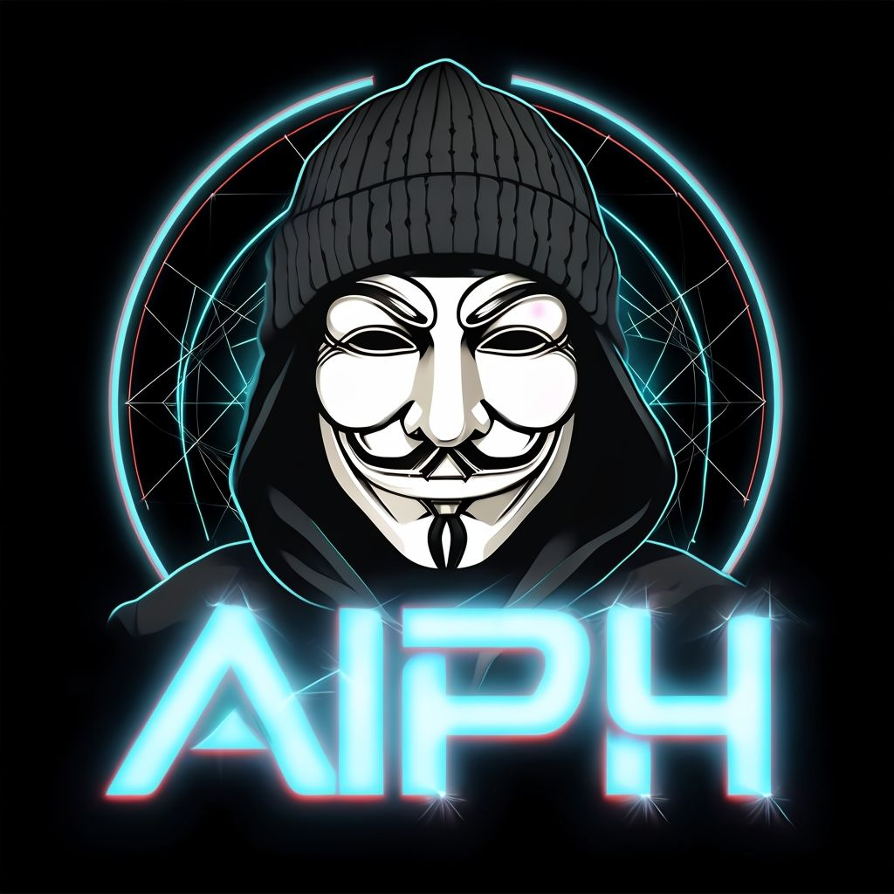

<pre>
<h1>AIPH</h1>

<h3>🌐  IDIOMAS    🎶  INSTRUMENTOS    💻  TECNOLOGIA</h3>
</pre>

---

**Nosso objetivo é criar uma comunidade colaborativa onde todos possam crescer juntos, trocar experiências e se tornar experts nas áreas que amam!**

---

## 🚀 Como Participar

Para participar do servidor **AIPH**, siga os passos abaixo:

- **[Discord](https://)**

---

## ⚖️ Regras do Servidor

Para manter um ambiente saudável e produtivo, todas as interações no servidor devem seguir estas regras básicas:

> _Violação das regras podem resultar em punições, como avisos, kicks ou banimentos._

**[Ver Regras](regras.md)**.

## 💻 Requisitos

Para contribuir como **MOD** / **ADMIN**, verifique os requisitos mínimos necessários:

**[Ver Requisitos](requisitos.md)**

---

## 🤝 Contribuições

Se você deseja contribuir para este projeto ou sugerir melhorias, fique à vontade:

- Contato via e-mail: **izxqux@gmail.com**.

---

## 🤖 Usar Bot

O **AIPH** tem um bot feito em Python para dar boas-vindas aos novos usuários. Qualquer pessoa com conhecimento em programação pode usá-lo. Além disso, há um guia detalhado que ensina como rodar o bot em segundo plano no Android e configurar o dispositivo como um servidor para que o bot seja executado automaticamente ao ligar o celular.

**[Bot Discord em Segundo Plano no Android](bot/bot.md)**

---

**Junte-se a nós hoje mesmo e comece sua jornada de aprendizado no AIPH!**